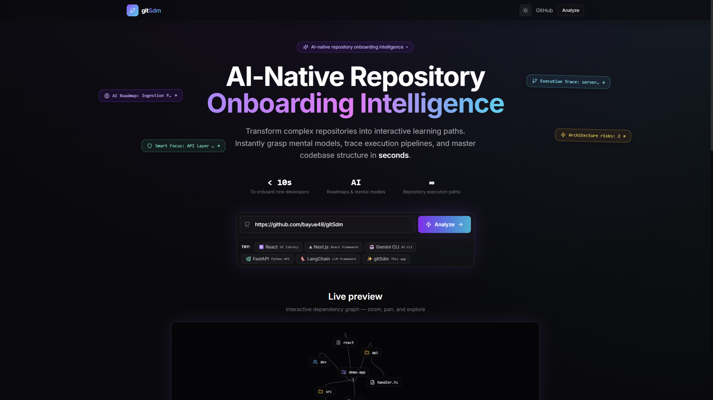
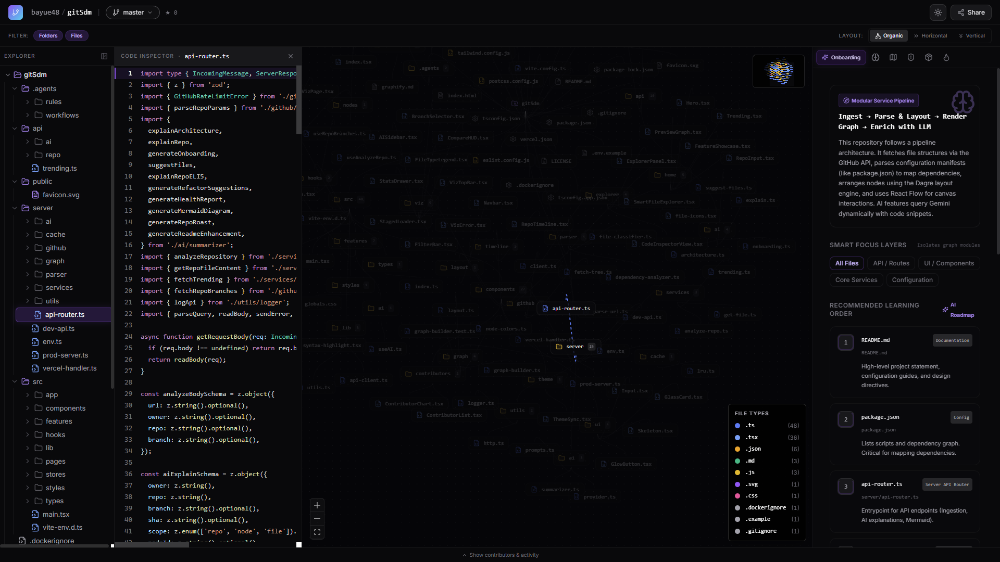

# gitSdm

AI-powered GitHub repository visualization platform (**Git Software Dependency Map**). Paste a public repo URL and explore an interactive dependency graph, architecture insights, file explorer, contributors, and commit timeline.



## Stack

- **Frontend:** React, Vite, TypeScript, Tailwind CSS, Framer Motion, React Flow
- **Backend:** Vercel serverless API routes or Node production server, Octokit, provider-agnostic AI (Gemini / OpenAI / Anthropic / mock)

## Quick start

```bash
cp .env.example .env
pnpm install
pnpm run dev
```

Open [http://localhost:5173](http://localhost:5173). API routes are served via Vite middleware in development.

## Environment variables

| Variable | Description |
|----------|-------------|
| `GITHUB_TOKEN` | Optional. Increases GitHub API rate limits for public repos |
| `AI_PROVIDER` | `mock` (default), `gemini`,`openai`, or `anthropic` |
| `OPENAI_API_KEY` | Required when `AI_PROVIDER=openai` |
| `ANTHROPIC_API_KEY` | Required when `AI_PROVIDER=anthropic` |
| `GEMINI_API_KEY` | Required when `AI_PROVIDER=gemini` |
| `GEMINI_MODEL` | Optional when `AI_PROVIDER=gemini`; see `.env.example` |
| `GEMINI_API_VERSION` | Optional when `AI_PROVIDER=gemini`; defaults to `v1alpha` |
| `OPENAI_MODEL` | Optional when `AI_PROVIDER=openai`; see `.env.example` |
| `ANTHROPIC_MODEL` | Optional when `AI_PROVIDER=anthropic`; see `.env.example` |

## Scripts

- `pnpm run dev` — start Vite dev server with API middleware
- `pnpm run build` — build the Vite frontend into `dist/`
- `pnpm run build:server` — build the Node production server into `dist-server/`
- `pnpm run build:docker` — build both frontend and production server
- `pnpm run start` — serve `dist/` and `/api/*` from the production Node server
- `pnpm run preview` — preview the frontend bundle only
- `pnpm test` — run unit tests (manifest parsers)

## Production with Docker

The Docker image builds the Vite app, bundles a small Node server, serves static files from `dist/`, and handles `/api/*` using the same API router as development/Vercel.

```bash
docker build -t gitsdm .
docker run --rm -p 3000:3000 --env-file .env gitsdm
```

Open [http://localhost:3000](http://localhost:3000).

For minimal setup, `GITHUB_TOKEN` is optional but recommended. AI features use `AI_PROVIDER=mock` by default; set the matching API key when using `gemini`, `openai`, or `anthropic`.

## Deploy (Vercel)

1. Push to GitHub and import in Vercel
2. Set environment variables in the project dashboard
3. Deploy — API routes in `/api` run as serverless functions

## Deploy (Google Cloud Run)

Cloud Run uses the Dockerfile in this repo. The container builds the Vite frontend, bundles the Node production server, and listens on the `PORT` value provided by Cloud Run.

### Prerequisites

- A Google Cloud project with billing enabled
- `gcloud` CLI installed and authenticated
- Artifact Registry and Cloud Run APIs enabled

```bash
gcloud auth login
gcloud config set project YOUR_PROJECT_ID
gcloud services enable run.googleapis.com artifactregistry.googleapis.com cloudbuild.googleapis.com
```

### Build and Push

Create an Artifact Registry Docker repository once:

```bash
gcloud artifacts repositories create gitsdm \
  --repository-format=docker \
  --location=us-central1 \
  --description="gitSdm container images"
```

Build the image with Cloud Build:

```bash
gcloud builds submit \
  --tag us-central1-docker.pkg.dev/YOUR_PROJECT_ID/gitsdm/gitsdm:latest
```

### Deploy

For the default mock AI provider:

```bash
gcloud run deploy gitsdm \
  --image us-central1-docker.pkg.dev/YOUR_PROJECT_ID/gitsdm/gitsdm:latest \
  --region us-central1 \
  --platform managed \
  --allow-unauthenticated \
  --set-env-vars AI_PROVIDER=mock
```

With GitHub and AI API keys, prefer Secret Manager instead of putting secrets directly in command history:

```bash
printf "YOUR_GITHUB_TOKEN" | gcloud secrets create gitsdm-github-token --data-file=-
printf "YOUR_GEMINI_API_KEY" | gcloud secrets create gitsdm-gemini-api-key --data-file=-

gcloud run deploy gitsdm \
  --image us-central1-docker.pkg.dev/YOUR_PROJECT_ID/gitsdm/gitsdm:latest \
  --region us-central1 \
  --platform managed \
  --allow-unauthenticated \
  --set-env-vars AI_PROVIDER=gemini \
  --set-secrets GITHUB_TOKEN=gitsdm-github-token:latest,GEMINI_API_KEY=gitsdm-gemini-api-key:latest
```

After deployment, Cloud Run prints the service URL. Open that URL to use the app.

To update an existing Cloud Run service after code changes, rebuild and redeploy with the same commands:

```bash
gcloud builds submit \
  --tag us-central1-docker.pkg.dev/YOUR_PROJECT_ID/gitsdm/gitsdm:latest

gcloud run deploy gitsdm \
  --image us-central1-docker.pkg.dev/YOUR_PROJECT_ID/gitsdm/gitsdm:latest \
  --region us-central1
```

## Features

- **Interactive Repository Structure Graph**: Custom canvas nodes displaying folders, files, configuration files, and direct contributors. Supports three layout modes: Organic Cluster, Horizontal Tree, and Vertical Tree.
- **Interactive Canvas Legend & Filters**: A top-right floating legend panel that allows users to dynamically toggle the visibility of specific node types (Repository, Directory, Code/Assets) and diff change statuses (+ Added, ~ Modified, - Deleted) with smart parent directory structure preservation.
- **Smart File Explorer**: Nested filesystem tree navigation featuring distinct custom badges highlighting entry points, configurations, and tests.
- **Premium Code Inspector**: Instant, interactive code previewer featuring a custom tokenized syntax-highlighted skeleton loading state for rich user experiences.
- **Multi-Ecosystem Dependency Parsing**: Automatic extraction and mapping of package dependencies across npm (`package.json`), Python (`requirements.txt` / `pyproject.toml`), Rust (`Cargo.toml`), Go (`go.mod`), Java (`pom.xml`), and Docker (`Dockerfile`).
- **AI-Powered Codebase Intelligence**:
  - *Explain Node/Repo*: Comprehensive file and folder breakdowns (Standard and ELI5 modes).
  - *Architecture overview*: Automatic architectural diagram generation and module relationships.
  - *Health & Maintainability*: Automated analysis reports highlighting complexity, maintainability scores, and refactoring recommendations.
  - *Intelligence Playground*: README Enhancers, Repository Roast generator, and customized learning path recommendations.
- **Branch Selection & Diff Comparison**: Switch between any branch/tag in real time or compare branch differences directly inside the visualization.
- **Robust AI Error Handling**: Gorgeous glassmorphic error card components with automatic retry actions to gracefully handle rate limit throttling or transient serverless API issues.
- **Contributor Insights**: Bar chart breakdown of authors and commit timelines spanning the last 90 days.
- **High-Performance Caching**: Intelligent server-side LRU cache to reduce latency and GitHub API rate limits.

### Premium Code Inspector Loading State


## Limits

- Public repositories only
- Tree capped at ~2000 files for serverless performance
- AI context limited to summaries and small snippets (never full repo)

## License

MIT
